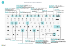

# Nur PC-TastenkombinationskurzübersichtKeyboard Quick Reference - PC Only

#### AllgemeinGeneral

|Drücken Sie diese TastenPress these keys|VorgehensweiseTo do this|  
|-|-|
|Alt+F2Alt+F2 ALT+NAlt+N ALT+UMSCHALT+NAlt+Shift+N ALT+OAlt+O ALT+QAlt+Q ALT+OBENAlt+Up ALT + NACH-UNTEN-TASTEAlt+Down Arrow ALT+TAlt+T ALT+UMSCHALT+WAlt+Shift+W Strg+EinfügenCtrl+Insert STRG-ENTFCtrl-Delete Ctrl+Shift+F12Ctrl+Shift+F12 Ctrl+F1Ctrl+F1 Ctrl+ClickCtrl+Click Shift+F12Shift+F12 F5/Ctrl+F5F5/Ctrl+F5 TAB/UMSCHALT+TABTab/Shift+Tab F6/Umschalt+F6F6/Shift+F6 |Infoboxbereich anzeigen und ausblenden.Show and hide the FactBox pane Erstellen eines neuen DatensatzesCreate a new record Schließen Sie einen neu erstellten Datensatz und erstellen Sie einen neuen Datensatz.Close a newly created record and create a new one Fügen Sie eine neue Notiz für den ausgewählten Datensatz hinzuAdd a new note for the selected record Öffnen Sie **Mitteilen**Open **Tell me** Öffnen Sie QuickInfo oder ÜberprüfungsfehlerOpen tooltip or validation error Dropdown oder Lookup für AnzeigeOpen a drop-down or look up Öffnen der Seite **Meine Einstellungen**.Open the **My Settings** page Öffnen Sie die aktuelle Karte oder das Dokument in einem neuen FensterOpen the current card or document in a new window Fügen Sie eine neue Zeile in einem Dokument hinzuInsert a new line on a document Löschen Sie die Zeile in einem Dokumenten, Journal oder ArbeitsblattDelete the line on a document, journal, or worksheet Maximieren Sie den Werbebuchungsteil auf einer DokumentseiteMaximize the line items part on a document page Hilfe für die Seite öffnenOpen help for the page Navigieren Sie beim Personalisieren und AnpassenNavigate when personalizing and customizing Öffnen Sie den Rollen-Explorer, eine Funktionsübersicht.Open the role explorer, a feature overview Die Seite aktualisieren/neu laden.Refresh/reload page Fokus auf das nächste/vorherige Element richtenMove focus to the next/previous element Weiter zum nächsten Inforegister/TeilMove to next FastTab/part|

#### Navigieren und Zeilen auswählenNavigate & Select Rows

|Drücken Sie diese TastenPress these keys|VorgehensweiseTo do this|
|-|-|
|Start/EndeHome/End Strg+Start/EndeCtrl+Home/End  Strg+nach unten/nach obenCtrl+Up/Down Strg+ACtrl+A  STRG+LEERTASTECtrl+Space Ctrl/Shift+ClickCtrl/Shift+Click Strg+nach oben/untenShift+Up/Down Umschalttaste +Seite nach Unten/ObenShift+Page Up/Down Ctrl+EnterCtrl+Enter|Zum ersten/letzten Feld gehen.Go to first/last field Zur ersten/letzten Zeile.Go to first/last row Navigieren Sie ohne die Auswahl zu verlierenNavigate without losing selection Alles auswählenSelect all Toggle-Zeilen-AuswahlToggle row selection  Fügen Sie die Zeile/Zeilen der Angaben hinzuAdd the row/rows to the selection Fügen Sie Zeilen über/unter der Auswahl hinzuAdd row above/below to selection Sichtbare Zeilen darüber/darunter auswählenSelect visible rows above/below  Fokussieren Sie auf die ListeFocus out of the list|

#### Kopieren und einfügenCopy & Paste

|Drücken Sie diese TastenPress these keys|VorgehensweiseTo do this|
|-|-|
|Strg+C/VCtrl+C/V F8F8|Zeilen kopieren/einfügenCopy/paste rows Kopiere Feld in aktuellen ZeileCopy field above into current row|

#### Suchen, filtern und sortierenSearch, Filter, & Sort

|Drücken Sie diese TastenPress these keys|VorgehensweiseTo do this|
|-|-|
|Alt+F7Alt+F7 F3F3 Shift+F3Shift+F3 Ctrl+Shift+F3Ctrl+Shift+F3 Alt+F3Alt+F3 Shift+Alt+F3Shift+Alt+F3 Ctrl+Alt+Shift+F3Ctrl+Alt+Shift+F3|Sortieren Sie die ausgewählte Spalte in aufsteigender/absteigender Reihenfolge.Sort column in ascending/descending order Toggle-SucheToggle search Wechselt zwischen Filterbereich; Fokus auf FeldfilterToggle filter pane; focus on field filters Wechselt zwischen Filterbereich; Fokus auf FeldfilterToggle filter pane; focus on totals filters Filtern Sie ausgewählte ZellwerteFilter on selected cell value Filter auf ausgewählten Felder hinzufügenAdd filter on selected field Filter zurücksetzenReset filters|

#### SchnelleingabeQuick Entry

|Drücken Sie diese TastenPress these keys|VorgehensweiseTo do this|
|-|-|
|STRG+UMSCHALT+EINGABECtrl+Shift+Enter EINGABETASTE/UMSCHALTTASTE+EINGABETASTEEnter/Shift+Enter|Zum nächsten Schnelleingabefeld außerhalb einer Liste navigierenGo to next Quick Entry field outside a list Zum nächsten/vorherigen Schnelleingabefeld navigierenGo to next/previous Quick Entry field|

##### BerichtvorschauReport Preview

|Drücken Sie diese TastenPress these keys|VorgehensweiseTo do this|
|-|-|
|Strg+Start/EndeCtrl+Home/End|Zur ersten/letzten Seite.Go to the first/last page|

> [!TIP]
> Für eine grafische, druckfreundliche Version wählen Sie das folgende Bild und laden Sie die PDF-Datei herunter.For a graphical, print-friendly version, choose the following image and download the PDF file.
>
> 
